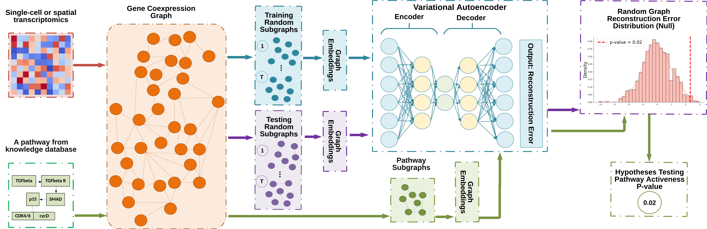

# CPACT: Chain Pathway Activity Characterization Tool

**CPACT** (Chain Pathway Activity Characterization Tool) is a novel knowledge-base-informed method designed to infer pathway activity by capturing chain-like topology structures in gene co-expression graphs. It integrates **graphical modeling**, **deep learning**, and **statistical hypothesis testing** to provide a high-accuracy, computationally efficient solution for single-cell RNA-sequencing (scRNA-seq) pathway analysis.

## Key Features

- **Biologically-Informed Insights**: CPACT identifies active pathways by analyzing chain-like topology structures in gene co-expression graphs, rather than relying solely on marginal gene expression.
- **High Accuracy**: Demonstrated superior performance in identifying active pathways across multiple cell types.
- **Resilient to Batch Effects**: Mitigates batch effects by leveraging co-expression relationships rather than marginal expression levels.

## How CPACT Works

1. Constructs a gene co-expression graph from scRNA-seq data.
2. Extracts pathway subgraphs and generates random subgraphs for null comparisons.
3. Derives graph embeddings to capture relevant topological features.
4. Uses a graph-based **variational autoencoder (VAE)** to establish a null distribution for pathway activeness.
5. Performs statistical hypothesis testing to determine pathway activity and computes effect sizes.



## Installation

To install CPACT, use the following steps:

```bash
# Clone the repository
git clone https://github.com/your-username/CPACT.git

# Navigate to the directory
cd CPACT

# Install dependencies
pip install -r requirements.txt
